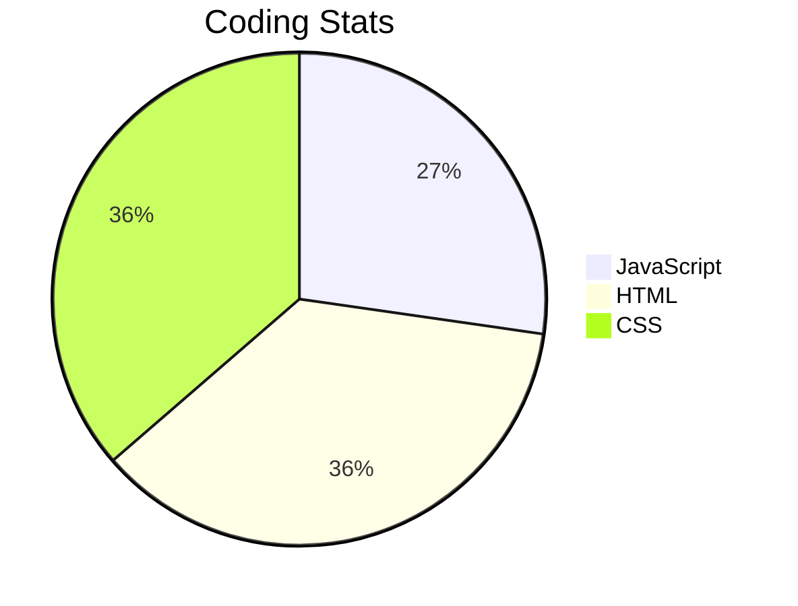

## WELCOME TO MY GITHUB ACCOUNT!

### About me:
My name is Lauren, I am 22 years old, and I am a student at MITT studying software development. I joined the program to learn the tools to code my own video game, as it's always been my dream to create one. My favourite aspect of coding is its objectivity; if my answer is right, it's right. 

I'm currently working on a personal project creating a game designed for web browsers. I'm inspired by old RPGs as that is all I have the capability to program right now. The first version of this project will be uploaded once the HTML is structured and I implement DOM/BOM elements. 

#### Skills:
- HTML
- CSS
- JavaScript

#### Learning:
- CLI
- Object Oriented Programming (JS)
- Communication and Presentation Skills

#### Fun Facts:
- My drink of choice is Dr. Pepper
- I LOVE Nintendo games, especially Pokémon
- Most of the music I listen to is in Japanese (I do not speak Japanese)
- I love desserts!!!

#### Stats:

